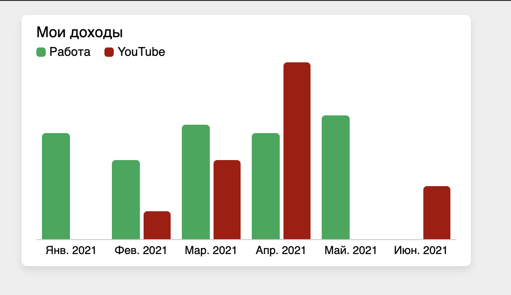

# Нарисовать диаграмму

## Дополнительные требования

* Использовать готовые библиотеки нельзя.
* Предполагается, что не будет отрицательных значений.
* Данные могут приходить в произвольном порядке, но выводиться - по дате.
* За определенную дату данные могут отсутствовать, но даты приходить будут.
